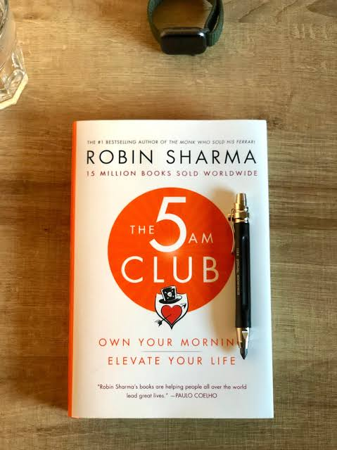
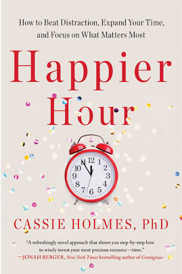
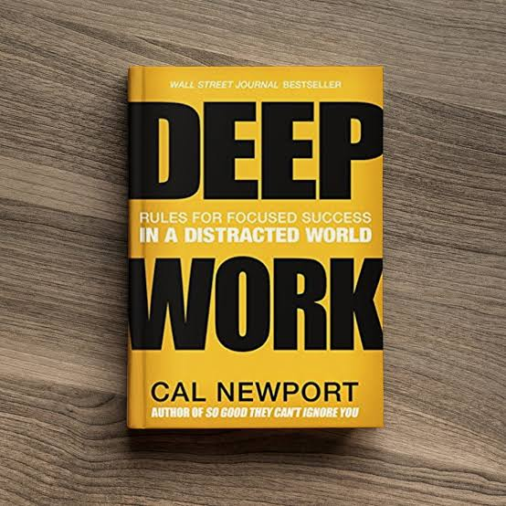
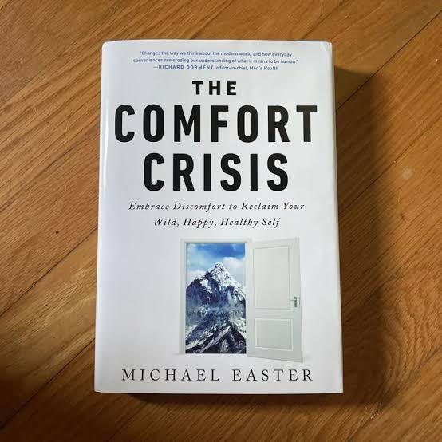
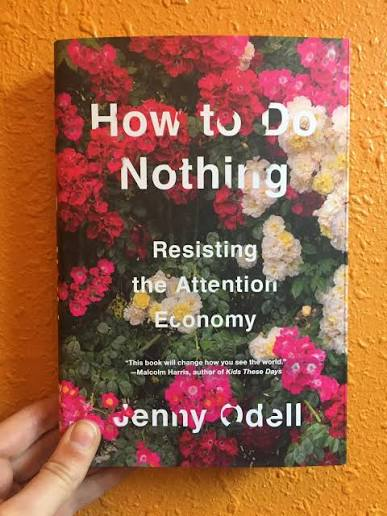
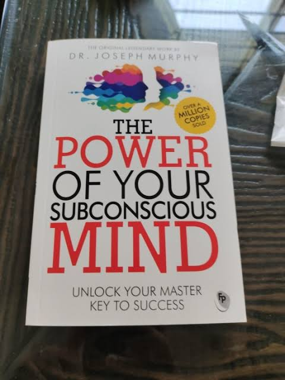
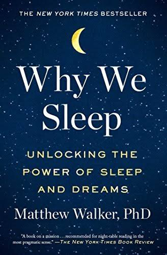

# Week 01 — Success Mindset (Mindset OS)

Part of the DevOps Micro Internship (DMI) Cohort 3 with Agentic AI

---

## Purpose (Read This First)

This week is not motivation homework.

This is you building your **Mindset OS** — the system you will use for the next 5 months (and honestly, for years).

### Expectations

* Be honest.
* Be specific.
* Be practical.
* Write like an adult professional: clear sentences, no one-liners.

You will reuse this in later weeks. So do it properly once.

---

# Assignment 1. What is something you believe to be true that most people around you would disagree with?

### Rules

* No "safe" answers.
* Must be your real belief (not copied from internet).
* Minimum 50 words.

**Hint:** What do you believe about career, money, learning, discipline, relationships, health, success, life, tech industry, etc. that most people don't agree with?

## Answer

I believe people should not limit themselves to one career for life because the human mind can learn and adapt continuously. I also do not believe in soulmates; healthy relationships are built on kindness, respect, and commitment. Finally, I believe discipline comes from consistency. Repeating positive actions over time creates habits that eventually shape our success and the direction of our lives.

---

# Assignment 2. What are the top 3 objective truths you discovered through experimentation and results?

### Definition

Objective truths do not depend on opinions. They hold true regardless of how people feel.

Write each truth in this format:

**Truth:** (1 sentence)

**Evidence from my life:** (2–4 lines: what you tried + what happened)

---

## Truth #1

### Truth

Consistency beats motivation.

### Evidence from my life

I discovered that studying a little every day produced better results than waiting until I felt motivated. Passing my AWS certification and learning DevOps happened because I stayed consistent, even on days I did not feel like studying.

---

## Truth #2

### Truth

Skills can be transferred across industries

### Evidence from my life

I experimented by combining my procurement experience with cloud and DevOps learning. The result was that I developed a unique professional profile and attracted opportunities that I would not have had by staying in one field.

---

## Truth #3

### Truth

Relationships are sustained by actions, not feelings.

### Evidence from my life

Through life experiences, I discovered that kindness, respect, and reliability matter more than excitement or butterflies. Strong relationships lasted because of consistent behavior and shared values.

---

# Assignment 3. What does your 2.0 version look like?

### Instructions

Write as if a journalist is writing about you **3 to 7 years from now** (not 20 years).

**Minimum 300 words.**

### Rules

* Write in past tense, like it already happened.
* Don't use "likes to / wants to / hopes to."
* Use specifics:

  * built
  * shipped
  * led
  * published
  * earned
  * relocated
  * contributed
* Include skills proof:

  * projects
  * portfolios
  * GitHub
  * blogs
  * certifications
  * job role
  * leadership
  * community contribution
* Add 1–3 images if you can (optional but powerful).

### Publish It Publicly On Any ONE

* LinkedIn
* Medium
* WordPress
* Blogspot
* Personal blog
* Portfolio page

Include this line:

> **P.S. This post is part of the DevOps Micro Internship (DMI) with Agentic AI — Cohort 3 — by [Pravin Mishra](https://www.linkedin.com/in/pravin-mishra-aws-trainer/). My graded progress is public: https://dmi.pravinmishra.com/s/YOUR-GITHUB-USERNAME.html · Start your DevOps journey: https://dmi.pravinmishra.com/?utm_source=student&utm_medium=ps-blog&utm_campaign=cohort3**

## Your Article

MY VERSION 2.0

She earned multiple industry certifications, including the AWS Certified Cloud Practitioner, AWS Solutions Architect Associate, and several DevOps-related credentials. She built and shipped cloud-based automation projects that demonstrated how procurement processes could be improved through technology. Her GitHub portfolio showcased projects involving serverless applications, infrastructure automation, CI/CD pipelines, and cloud monitoring solutions. Several of her repositories attracted contributions from other professionals seeking to apply technology in traditional business functions.

After transitioning into a Cloud and Business Transformation role, she led digital transformation initiatives that automated procurement reporting, vendor onboarding, and inventory tracking processes. These projects significantly reduced manual work and improved operational efficiency for the organizations she served.

Beyond her corporate achievements, Onyinye published articles and blog posts explaining cloud computing and DevOps concepts in simple terms for professionals from non-technical backgrounds. Her writings gained attention because they addressed a growing audience of mid-career professionals looking to transition into technology without abandoning their previous experience.

Write on Medium
She also contributed to the technology community by mentoring women and experienced professionals entering cloud computing and DevOps. She organized virtual workshops, spoke at professional events, and shared learning resources through social media and community groups. Her story became an example of lifelong learning and adaptability.

By 2030, she had built a reputation as a leader who understood both business and technology. Recruiters and industry professionals frequently referenced her career journey as proof that career transitions were possible at any stage of life. Her transformation demonstrated that expertise gained in one field could become a powerful advantage when combined with emerging technologies, and she had established herself as a respected voice in digital transformation and modern procurement.

P.S. This post is part of the DevOps Micro Internship with Agentic AI Cohort 3 by Pravin Mishra.

You can begin your own DevOps journey by joining the DMI waiting list:
https://lnkd.in/gQT45gGa

### Public Link

Paste your link here:

(https://medium.com/@onyinyenwoke/my-version-2-0-a730146cc446)

---

# Assignment 4. Have you ever cut corners (unethical / dishonest / shortcut behavior — not necessarily illegal)? If yes, how did it make you feel?

### Important

You don't need to write the full story.

Focus on the feeling:

* guilt
* fear
* shame
* stress
* regret
* numbness
* etc.

This is about self-awareness, not judgment.

### Answer Format

**Yes / No**

If Yes:

**What emotion did you feel?** (minimum 50–100 words)

## Answer

I have never knowingly cut corners or engaged in dishonest behaviour. In procurement, we frequently encounter situations that test our integrity. Early in my career, a customer wanted to give me a gift in appreciation for facilitating a transaction. As a new employee, I felt uncomfortable accepting it because I knew it could create a conflict of interest or the appearance of one.

I immediately reported the situation to senior management and followed the company's guidance. The experience reinforced my belief that transparency is critical in procurement because trust is one of our most important assets. I felt proud that I had done the right thing, and I was later recognized by our Managing Director with an integrity award.

That experience shaped my leadership style. I believe procurement professionals should always err on the side of disclosure rather than putting themselves or the organization at risk

---

# Assignment 5. What are 10 non-fiction books you plan to read in the next 1 year?

### Rules

* Mention **Title + Author**
* Any language allowed
* No fiction novels

### Tip

Choose books that improve:

* mindset
* communication
* productivity
* health
* money
* career
* leadership

## Book List

1. 
2. 
3. 
4. 
5. 
6. .
7. 
8. 
9. 
10. 

---

# Assignment 6. What are the things you will measure regularly in your life and career?

### Rules

List topics only. No need to share numbers.

### Must Include

* Learning / skill
* Output / proof
* Health / energy
* Time / focus
* Money / finance (personal or business)

### Example

* Learning hours per week
* Deep work sessions per week
* Projects shipped / documented
* Steps / workouts
* Sleep hours
* Spending tracker

## My Metrics

* Continuous learning and skill development
* Career progression and professional impact
* Financial health and wealth creation
* Physical health and fitnes
* Mental and emotional well-being
* Quality of relationships and family life
* Personal integrity and values alignment
* Productivity and time management
* Leadership growth and contribution to others
* Consistency in habits and self-discipline

---

# Assignment 7. Brain Dump + 5-Month System Plan

## Step 1: Brain Dump (Private)

Do a brain dump of everything in your mind into a notebook.

Examples:

* Bills
* Tasks
* Worries
* Goals
* Pending messages
* Ideas
* Responsibilities

### Did You Do It?

**Yes / No**

Answer:Yes

Add your answer here...

* Career Development
* Travel
* Impact
* Review Monthly Budget

## Step 2: Your 5-Month Routine + Focus Blocks

Create a simple plan you can realistically follow for the next 5 months.

### Weekly Routine

Example:

* Mon–Thu: 60 min deep work
* Sat: DMI session
* Sun: Weekly review

#### My Weekly Routine

.
* Mon–Thu: 3hours deep work
* Sat: DMI session
* Sun: Weekly review
---

### Focus Blocks

#### When Will You Do DMI Work? (Days + Time)

 7-10pm Everyday of the Week

#### How Many Sessions Per Week?

3 hours

---

### Distraction Rules

Examples:

* Phone rules
* Social media rules
* Environment setup

#### My Distraction Rules

Add your answer here...

* Phone on airplane mode and placed out of reach
* Dsable Instagram and Facebook
* Set Up a reading room in my home

# Reflection – Week 1

### Biggest insight I got about myself this week

I realized that I thrive when I have structure and clear goals. I realized that my diverse experiences in procurement and technology are a strength, not a disadvantage.

### My biggest weakness/loop I noticed

I realized that my phone is one of my biggest distractions. I tend to reach for it out of habit, even when I have important work to do. To break this loop, I am practicing intentional disconnection by putting it away and temporarily deactivating it during deep work sessions.

### One system I will implement from this week (exact habit + time)

From this week, I will put my phone on Do Not Disturb and keep it in another room from 7:00 PM to 10:00 PM every Monday to Thursday. During that hour, I will focus only on studying AWS, DevOps, or working on my projects.

### LinkedIn Post

Paste your LinkedIn post link here:

WEEK 1- SUCCESS MINDSET
I got into the internship... Yippee! 
This weekend, I officially started the DevOps Micro Internship (DMI) Cohort 3, and guess what? We didn't begin with tools or code. We started with something even more important: a success mindset.
Some lessons from Day 1 that really resonated with me:

 Consistency beats motivation.
 Small habits lead to big transformations.
Growth starts with taking ownership of your journey.
You can reinvent yourself at any stage of your career.

One thing I discovered about myself? My phone is one of my biggest distractions. So, my first system is simple: one hour of uninterrupted deep work every evening, phone on Do Not Disturb and out of reach.

The next 14 weeks will be filled with learning, building, and stretching beyond my comfort zone, and I'm excited for every bit of it.
Here's to showing up every day and becoming a little better than yesterday. 

Thank you, Pravin Mishra, for this opportunity!
P.S. This post is a part of DevOps Micro Internship with Agentic AI Cohort-3 by Pravin Mishra. You can start your DevOps journey by joining this Discord community ( https://lnkd.in/eFZM28RQ ).

https://www.linkedin.com/posts/nwoke-onyinye_join-the-dmi-devops-micro-internship-share-7478882535759036417-Veu_/?highlightedUpdateUrn=urn%3Ali%3Aactivity%3A7478882538611113986&highlightedUpdateType=SOCIAL_SHARE&origin=SOCIAL_SHARE&utm_source=share&utm_medium=member_desktop&rcm=ACoAAAo3AmwBML7hksPwy4zQreoUkgXVNBf9D1c

---

## 10. Proof of Work

- LinkedIn Post URL: https://www.linkedin.com/posts/nwoke-onyinye_join-the-dmi-devops-micro-internship-share-7478882535759036417-Veu_/?highlightedUpdateUrn=urn%3Ali%3Aactivity%3A7478882538611113986&highlightedUpdateType=SOCIAL_SHARE&origin=SOCIAL_SHARE&utm_source=share&utm_medium=member_desktop&rcm=ACoAAAo3AmwBML7hksPwy4zQreoUkgXVNBf9D1c 
- Blog / Medium : https://medium.com/@onyinyenwoke/i-didnt-change-careers-i-expanded-one-my-journey-from-procurement-to-tech-2a16248724af 

---

## 📌 About DMI & CloudAdvisory

DevOps Micro Internship (DMI) is a project-based DevOps program run by Pravin Mishra (The CloudAdvisory) focused on real-world execution, systems thinking, and career readiness.

It helps learners build strong DevOps foundations with hands-on experience.

## 📌 Resources

- 🌐 **DMI Official Website:** https://pravinmishra.com/dmi  
- 🎓 **DevOps for Beginners (Udemy):** https://www.udemy.com/course/devops-for-beginners-docker-k8s-cloud-cicd-4-projects/  
- 🎓 **Ultimate Agentic AI DevOps with Clude Code** https://www.udemy.com/course/ultimate-agentic-ai-devops-with-claude-code/?referralCode=448389767BC96284087B
- 🎓 **DevOps with Claude Code: Terraform, EKS, ArgoCD & Helm** https://www.udemy.com/course/devops-with-claude-code-terraform-eks-argocd-helm/?referralCode=1C5B734505D65A010FA3
- ▶️ **YouTube Playlist (DMI Cohort 3):** https://www.youtube.com/playlist?list=PLFeSNDtI4Cho  
- 🔗 **Pravin Mishra (LinkedIn):** https://www.linkedin.com/in/pravin-mishra-aws-trainer/  
- 🏢 **CloudAdvisory (LinkedIn):** https://www.linkedin.com/company/thecloudadvisory/

---

*This submission is part of DevOps Micro Internship (DMI) Cohort 3 — Agentic AI Track*