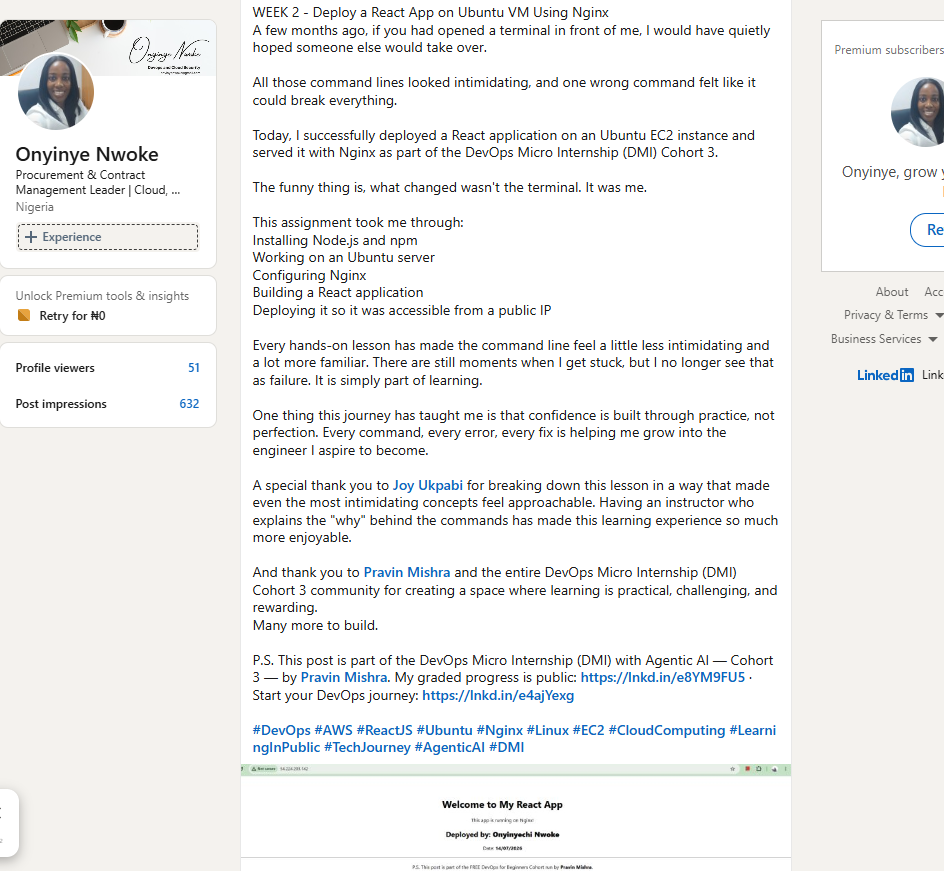

# Assignment 2 — Deploy a React App on Ubuntu VM Using Nginx

Part of the DevOps Micro Internship (DMI) Cohort 3 with Agentic AI

---

## Purpose

In this assignment, you will deploy a React application on an Ubuntu EC2 instance and serve it using Nginx. You will provision a Linux server, install the required tools, personalize the application with your details, and verify that it is publicly accessible via a browser.

---

# Task 1 — Setup Environment (Node.js & npm)

## Goal

Install Node.js and npm on the Ubuntu VM and verify the installation.

### Evidence

#### Screenshot 1 — Output of `node -v && npm -v` showing installed versions

---

# Task 2 — Setup Environment (Nginx)

## Goal

Install Nginx, start the service, and confirm it is running.

### Evidence

#### Screenshot 2 — Output of `systemctl status nginx --no-pager` showing Active (running)

---

# Task 3 — Clone React Application

## Goal

Clone the project repository and verify the project files are present.

### Evidence

#### Screenshot 3 — Output of `ls` inside the `my-react-app` directory showing project files

---

# Task 4 — Modify Application (Personalization)

## Goal

Update `App.js` with your full name and the current date.

### Evidence

#### Screenshot 4 — `nano App.js` open showing your full name and date filled in

---

# Task 5 — Build React Application

## Goal

Install dependencies and generate the production build.

### Evidence

#### Screenshot 5 — Output of `ls` inside `my-react-app` showing the `build/` folder generated

---

# Task 6 — Deploy React Build to Nginx Web Root

## Goal

Copy the production build files to the Nginx web root directory.

### Evidence

#### Screenshot 6 — Output of `ls /var/www/html/` showing the deployed build contents

---

# Task 7 — Configure Nginx for React Application

## Goal

Apply Nginx configuration for React routing and confirm the service is active.

### Evidence

#### Screenshot 7 — Output of `systemctl is-active nginx` showing `active`

---

#### Screenshot 8 — Output of `cat /etc/nginx/sites-available/default` showing the Nginx config

---

# Task 8 — Test Deployment

## Goal

Verify the React application is publicly accessible via the server's public IP.

### Evidence

#### Screenshot 9 — Output of `curl ifconfig.me` showing the server's public IP address

---

#### Screenshot 10 — Browser showing the deployed React app at `http://<public-ip>` with your name and date visible

---

# LinkedIn Post (Required)

## WEEK 2 - Deploy a React App on Ubuntu VM Using Nginx
A few months ago, if you had opened a terminal in front of me, I would have quietly hoped someone else would take over.
All those command lines looked intimidating, and one wrong command felt like it could break everything.
Today, I successfully deployed a React application on an Ubuntu EC2 instance and served it with Nginx as part of the DevOps Micro Internship (DMI) Cohort 3.
The funny thing is, what changed wasn't the terminal. It was me.
This assignment took me through:
Installing Node.js and npm
Working on an Ubuntu server
Configuring Nginx
Building a React application
Deploying it so it was accessible from a public IP

Every hands-on lesson has made the command line feel a little less intimidating and a lot more familiar. There are still moments when I get stuck, but I no longer see that as failure. It is simply part of learning.
One thing this journey has taught me is that confidence is built through practice, not perfection. Every command, every error, every fix is helping me grow into the engineer I aspire to become.

A special thank you to Joy Ukpabi for breaking down this lesson in a way that made even the most intimidating concepts feel approachable. Having an instructor who explains the "why" behind the commands has made this learning experience so much more enjoyable.
And thank you to Pravin Mishra and the entire DevOps Micro Internship (DMI) Cohort 3 community for creating a space where learning is practical, challenging, and rewarding.
Many more to build. 

P.S. This post is part of the DevOps Micro Internship (DMI) with Agentic AI — Cohort 3 — by Pravin Mishra. My graded progress is public: https://dmi.pravinmishra.com/s/Onyinwoke.html · Start your DevOps journey: https://dmi.pravinmishra.com/?utm_source=student&utm_medium=ps-linkedin&utm_campaign=cohort3

#DevOps #AWS #ReactJS #Ubuntu #Nginx #Linux #EC2 #CloudComputing #LearningInPublic #TechJourney #AgenticAI #DMI

#### LinkedIn Post URL

Paste your LinkedIn post URL here:

https://www.linkedin.com/posts/nwoke-onyinye_devops-aws-reactjs-share-7482956849194131456-7ZCS/?highlightedUpdateUrn=urn%3Ali%3Aactivity%3A7482956851106594816&highlightedUpdateType=SOCIAL_SHARE&origin=SOCIAL_SHARE&utm_source=share&utm_medium=member_desktop&rcm=ACoAAAo3AmwBML7hksPwy4zQreoUkgXVNBf9D1c

---

#### Screenshot — LinkedIn post showing the deployed application

---

# Submission Instructions

- Add all required screenshots in your submission
- Full name must be visible in required screenshots
- Do not expose sensitive information (keys, passwords, account IDs)

---

# Completion Checklist

- [ ] Node.js and npm installed and verified (Screenshot 1)
- [ ] Nginx installed and running (Screenshot 2)
- [ ] Repository cloned and files verified (Screenshot 3)
- [ ] App.js updated with full name and date (Screenshot 4)
- [ ] Production build generated (Screenshot 5)
- [ ] Build files deployed to Nginx web root (Screenshot 6)
- [ ] Nginx configured and active (Screenshots 7 & 8)
- [ ] Public IP retrieved (Screenshot 9)
- [ ] React app accessible in browser with personal details visible (Screenshot 10)
- [ ] LinkedIn post published and URL submitted
- [ ] No sensitive data exposed

---

## 📌 About DMI & CloudAdvisory

DevOps Micro Internship (DMI) is a project-based DevOps program run by Pravin Mishra (The CloudAdvisory) focused on real-world execution, systems thinking, and career readiness.

It helps learners build strong DevOps foundations with hands-on experience.

---

## 📌 Resources

- 🌐 DMI Official Website: https://pravinmishra.com/dmi  
- 🎓 DevOps for Beginners (Udemy): https://www.udemy.com/course/devops-for-beginners-docker-k8s-cloud-cicd-4-projects/  
- 🎓 Agentic AI DevOps with Claude Code: https://www.udemy.com/course/ultimate-agentic-ai-devops-with-claude-code/  
- 🎓 DevOps with Claude Code: Terraform, EKS, ArgoCD & Helm: https://www.udemy.com/course/devops-with-claude-code-terraform-eks-argocd-helm/  
- ▶️ YouTube Playlist: https://www.youtube.com/playlist?list=PLFeSNDtI4Cho  
- 🔗 Pravin Mishra (LinkedIn): https://www.linkedin.com/in/pravin-mishra-aws-trainer/  
- 🏢 CloudAdvisory (LinkedIn): https://www.linkedin.com/company/thecloudadvisory/

---

*This submission is part of DevOps Micro Internship (DMI) Cohort 3 — Agentic AI Track.*