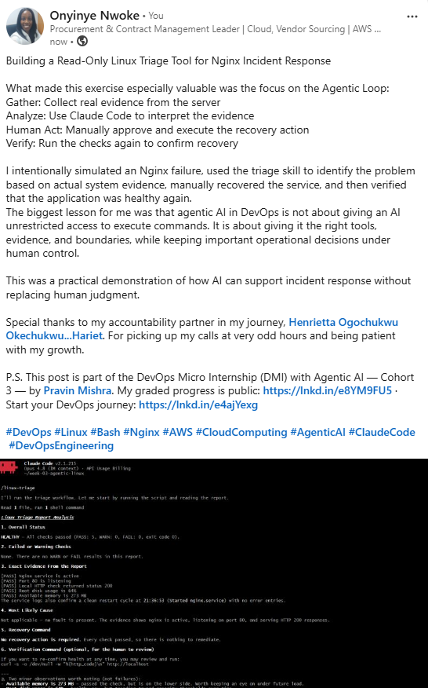

# Assignment 6 — Build an AI-Assisted Linux Health Check (AI-Assisted Linux Incident Triage)

Part of the DevOps Micro Internship (DMI) Cohort 3 with Agentic AI

---

## Purpose

In this assignment, you will build a read-only Bash triage script that checks the health of your Ubuntu server and Nginx application, connect it to Claude Code as a reusable `/linux-triage` skill, simulate a controlled Nginx incident, use the skill to gather and analyze evidence, recover the service manually, and verify recovery. The workflow follows the Agentic Loop: Gather → Analyze → Human Act → Verify.

---

# Task 1 — Confirm the Healthy Baseline and Create the Workspace

## Goal

Confirm that Nginx and the React application are healthy before building the automation.

### Evidence

#### Screenshot 1 — Output of `systemctl is-active nginx`, `ss -ltn | grep ':80'`, and `curl -I http://localhost`

---

#### Screenshot 2 — Output of `pwd` and `find . -maxdepth 4 -type d | sort` showing the workspace folder structure

---

### Notes

Answer the following in your own words:

**1. What proves that Nginx is running?**

The command systemctl is-active nginx returning active proves that the Nginx service is currently running. This confirms that the service process is active on the Ubuntu server.

---

**2. What proves that the server is listening for HTTP traffic?**

The command ss -ltn | grep ':80' shows that the server has a listening TCP socket on port 80. Port 80 is the standard port for HTTP traffic, so this proves that the server is ready to accept HTTP connections.

---

**3. Why must you capture a healthy baseline before simulating an incident?**

A healthy baseline provides a known-good comparison point. After the incident is simulated, I can compare the failed checks with the original healthy results to identify what changed and confirm that the recovery was successful.

---

# Task 2 — Create Project Context and Safety Rules in CLAUDE.md

## Goal

Tell Claude exactly what this project does and what it is not allowed to do.

### Evidence

#### Screenshot 3 — CLAUDE.md open in VS Code showing all four sections (Project Overview, Incident Workflow, Safety Rules, Output Rules)

---

### Notes

Answer the following in your own words:

**1. Why should Claude receive project-specific operational rules?**

Project-specific rules give Claude clear boundaries about the environment, the purpose of the project, and the actions it is allowed to perform. This reduces the chance of incorrect assumptions and helps Claude provide analysis that is relevant to the actual server.

---

**2. Why is the human required to execute the recovery command?**

Recovery actions can change the state of a production-like system and may have unintended consequences. Requiring human approval keeps the operator in control and ensures that the proposed action is reviewed before it is executed.

---

**3. Which rule prevents Claude from making an unsupported diagnosis?**

The rule requiring Claude to base its diagnosis only on collected evidence prevents unsupported conclusions. Claude must use the results from the triage checks rather than guessing about the cause of a problem.

---

# Task 3 — Use Agentic AI to Plan Before Writing the Script

## Goal

Use Claude Code to inspect the environment and produce a read-only plan before creating any Bash code.

### Evidence

#### Screenshot 4 — Claude Code showing the five-check plan and read-only inspection results

---

### Notes

Answer the following in your own words:

**1. Which part of this task represents the Gather phase?**

The read-only inspection of the server environment represents the Gather phase. Claude inspected the existing project structure and system information without changing the environment.

---

**2. Did Claude follow the instruction not to create files? How did you verify this?**

Yes. Claude followed the instruction because it only inspected the environment and produced a plan. I verified this by checking that no new script or project files were created during the planning stage.

---

**3. Why is planning before coding useful in DevOps automation?**

Planning before coding helps identify the required checks, expected outputs, thresholds, and safety boundaries before implementation begins. This reduces errors and makes the final automation more predictable and easier to test.

---

# Task 4 — Build the Linux Triage Bash Script

## Goal

Create one Bash script that gathers consistent Linux and Nginx health evidence.

### Evidence

#### Screenshot 5 — Top section of `linux-triage.sh` showing variables, thresholds, and the checks array

---

#### Screenshot 6 — Middle section showing check functions and conditionals

---

#### Screenshot 7 — Bottom section showing the loop, summary function, and exit behavior

---

#### Screenshot 8 — Output of `bash -n scripts/linux-triage.sh` (no syntax errors) and `ls -l scripts/linux-triage.sh` showing executable permission

---

### Notes

Answer the following in your own words:

**1. What is stored in the checks array?**

The checks array stores the names of the health-check functions that the script must execute. These functions represent the different areas of the server and Nginx application that need to be inspected.

---

**2. How does the `for` loop use that array?**

The for loop goes through each item in the checks array one at a time and executes the corresponding check function. This allows the script to run all checks consistently without repeating the same control-flow logic manually.

---

**3. Why are the health checks separated into functions?**

Separating the checks into functions makes the script easier to read, test, maintain, and update. Each function has a specific responsibility, such as checking the service, the listening port, or the HTTP response.
---

**4. What is the purpose of `$(...)` in this script?**

The $(...) syntax performs command substitution. It runs a command and places the command's output into another command, variable, or expression. This allows the script to capture and use information returned by system commands.
---

**5. Why does the script use different exit codes for HEALTHY, WARN, and FAIL?**

Different exit codes communicate the severity of the result to both humans and other automation. A healthy result indicates normal operation, a warning indicates something that may require attention, and a failure indicates that an important health check did not pass.

---

# Task 5 — Run and Understand the Healthy-State Report

## Goal

Run the Bash script against the healthy server and verify that it creates a report.

### Evidence

#### Screenshot 9 — Output of `./scripts/linux-triage.sh` showing your Full Name and all five check results

---

#### Screenshot 10 — Output showing the captured exit code and final summary

---

### Notes

Answer the following in your own words:

**1. What is the overall status of your healthy baseline?**

The overall status of the healthy baseline is HEALTHY because the important checks for the Nginx service, HTTP listening port, and local application response completed successfully without a failure.

---

**2. Which exact Linux evidence proves the application is serving traffic?**

The strongest evidence is the successful HTTP response from curl -I http://localhost, which returns an HTTP success response such as 200 OK. The listening socket on port 80 also confirms that the server is accepting HTTP connections.

---

**3. Did your script return exit code 0 or 1? Explain why.**

The script returned exit code 0 because the healthy baseline checks completed successfully and no failure condition was detected. This indicates that the system met the script's healthy-state requirements.

---

**4. What is the difference between a warning and a failure in this script?**

A warning means that a condition may need attention but does not necessarily mean that the application is unavailable. A failure means that an important health check did not pass, such as the service being stopped or the HTTP request failing.

---

# Task 6 — Create and Run the /linux-triage Skill

## Goal

Turn the Bash script into a reusable, manually invoked Agentic AI workflow.

### Evidence

#### Screenshot 11 — `SKILL.md` showing the frontmatter, allowed tool restrictions, and safety rules

---

#### Screenshot 12 — `/linux-triage` output for the healthy server

---

### Notes

Answer the following in your own words:

**1. Why does this skill have Bash, Read, and Grep, but not Write?**

Bash is needed to execute the read-only triage script, while Read and Grep allow Claude to inspect and search evidence. Write is intentionally excluded because the skill should not modify project files or make changes to the server during diagnosis.

---

**2. Why is `disable-model-invocation: true` useful for this skill?**

Add your answer here.

It ensures that the skill is manually invoked by the human operator rather than being triggered automatically by Claude. This provides an additional safety boundary and keeps the diagnostic workflow under human control.

**3. What part is performed by Bash, and what part is performed by Claude?**

Bash performs the objective evidence collection by running the health checks and producing the report. Claude then analyzes that evidence, identifies the most likely cause based on the results, and suggests an appropriate recovery action without executing it.

---

**4. Why is this better than asking Claude "Is my server healthy?" without giving it evidence?**

The triage workflow gives Claude real, current evidence from the server instead of relying on assumptions or general reasoning. This makes the analysis more grounded, reproducible, and easier to verify.

---

# Task 7 — Simulate an Nginx Incident and Let the Skill Diagnose It

## Goal

Create a controlled service failure, gather evidence through Bash, and let Claude analyze the evidence without taking recovery action.

### Evidence

#### Screenshot 13 — Output showing Nginx is inactive and the HTTP request fails

---

#### Screenshot 14 — `/linux-triage` output showing failed evidence, most likely cause, and a suggested recovery command

---

#### Screenshot 15 — `incident-failure-report.txt` showing the failed checks and your Full Name

---

### Notes

Answer the following in your own words:

**1. Which three checks failed?**

The Nginx service health check.
The HTTP listening-port check on port 80.
The local HTTP request check using curl.

---

**2. What evidence supports the conclusion that Nginx is unavailable?**

The evidence includes the Nginx service being inactive, the absence of a listening socket on port 80, and the failed HTTP request to http://localhost. Together, these results show that the web server was not available to serve the application.

---

**3. Did Claude execute the recovery command? Why is that important?**

No. Claude only analyzed the evidence and suggested the recovery command. This is important because restarting a service changes the system state, so the human operator must review and approve the action before executing it.

---

**4. Which phase of the Agentic Loop is represented by the Bash report?**

The Bash report represents the Gather phase because it collects objective evidence about the current state of the server and application.
---

**5. Which phase is represented by Claude's explanation?**

Claude's explanation represents the Analyze phase because it interprets the collected evidence, identifies the most likely cause, and recommends a possible next action.

---

# Task 8 — Recover Manually, Verify Again, and Write the Incident Summary

## Goal

Recover the service as the human operator and prove that the system is healthy again.

### Evidence

#### Screenshot 16 — Output showing Nginx is active and `curl -I http://localhost` returns 200 OK

---

#### Screenshot 17 — Second `/linux-triage` output showing successful recovery with no FAIL results

---

#### Screenshot 18 — Output of `ls -lah reports` showing both `incident-failure-report.txt` and `recovery-report.txt`

---

#### Screenshot 19 — `incident-summary.md` showing all required sections and your Full Name

---

### Notes

Answer the following in your own words:

**1. What action did you execute manually?**

I manually restarted the Nginx service using the approved recovery command. The recovery action was performed by the human operator rather than by Claude.

---

**2. What evidence proves that the service recovered?**

The recovery is proven by Nginx becoming active again, the server listening on port 80, and curl -I http://localhost returning a successful HTTP response such as 200 OK. The second triage report also showed no FAIL results.

---

**3. Why is the second triage run necessary?**

The second triage run verifies that the recovery action actually resolved the incident. It provides fresh evidence instead of assuming that restarting the service was successful.

---

**4. What could go wrong if an AI agent automatically restarted every failed service?**

An automatic restart could hide the real cause of an incident, interrupt an important process, create repeated restart loops, or make a problem worse. Some failures require investigation before taking corrective action.

---

**5. In one sentence, explain the difference between using AI as a chatbot and using AI in this agentic workflow.**

A chatbot mainly provides answers based on a conversation, while this agentic workflow uses AI to analyze real system evidence within defined safety boundaries and support a human-controlled operational decision.

---

# Incident Summary

Fill in all seven sections below in your own words.

**Full Name:** Onyinyechi N. Nwoke

**Date:** 15/07/2026

---

**1. Reported Symptom**

The React application became unavailable because the Nginx web server was intentionally stopped as part of a controlled incident simulation. HTTP requests to the local application failed.

---

**2. Evidence Collected**

The triage workflow collected evidence from the Nginx service status, the TCP listening socket on port 80, and an HTTP request to http://localhost. The evidence showed that Nginx was inactive, port 80 was no longer listening, and the local HTTP request failed.

---

**3. Most Likely Cause**

The most likely cause was that the Nginx service had been stopped. The service status, missing port 80 listener, and failed HTTP request all supported this conclusion.

---

**4. Human-Approved Recovery Action**

After reviewing Claude's evidence-based analysis and suggested recovery command, I manually restarted the Nginx service as the human operator.

---

**5. Verification**

After the manual recovery, Nginx was confirmed to be active again. Port 80 was listening, and curl -I http://localhost returned a successful HTTP response. A second /linux-triage run also completed without FAIL results.

---

**6. Safety Decision**

Claude was allowed to gather evidence and analyze the incident, but it was not allowed to execute the recovery command. The recovery action required human approval because restarting a service changes the state of the system and could have unintended consequences in a real environment.

---

**7. Agentic Loop Mapping**

The workflow followed the Agentic Loop: Gather → Analyze → Human Act → Verify. The Bash triage script gathered evidence, Claude analyzed the results, I manually performed the approved recovery action, and the second triage run verified that the service had recovered successfully.

---

# LinkedIn Post (Required)

## Evidence

#### LinkedIn Post URL

Paste your LinkedIn post URL here:

https://www.linkedin.com/posts/nwoke-onyinye_devops-linux-bash-share-7485104952219037696-ZiYM/?highlightedUpdateUrn=urn%3Ali%3Aactivity%3A7485104954400030720&highlightedUpdateType=SOCIAL_SHARE&origin=SOCIAL_SHARE&utm_source=share&utm_medium=member_desktop&rcm=ACoAAAo3AmwBML7hksPwy4zQreoUkgXVNBf9D1c

---

#### Screenshot — Published LinkedIn post

Add your screenshot here.

# GitHub Repository URL

Paste the URL of your GitHub folder or repository containing the assignment files here:

---

# Submission Instructions

- Add all required screenshots in your submission
- Full Name must be visible in required screenshots and the Bash report
- All written answers must be in your own words
- Do not expose sensitive information (keys, passwords, AWS account IDs, tokens)
- GitHub URL must be included in this document

---

# Completion Checklist

- [ ] Task 1: Healthy baseline confirmed, workspace created (Screenshots 1–2, Notes answered)
- [ ] Task 2: CLAUDE.md created with all four sections (Screenshot 3, Notes answered)
- [ ] Task 3: Five-check plan produced by Claude using read-only tools (Screenshot 4, Notes answered)
- [ ] Task 4: `linux-triage.sh` created, syntax validated, executable permission set (Screenshots 5–8, Notes answered)
- [ ] Task 5: Healthy-state report generated with no FAIL result (Screenshots 9–10, Notes answered)
- [ ] Task 6: `/linux-triage` skill created and run successfully on healthy server (Screenshots 11–12, Notes answered)
- [ ] Task 7: Nginx incident simulated, failed evidence captured, Claude did not execute recovery (Screenshots 13–15, Notes answered)
- [ ] Task 8: Nginx recovered manually, recovery verified, reports saved, incident summary complete (Screenshots 16–19, Notes answered)
- [ ] Incident summary contains all seven required sections
- [ ] LinkedIn post published and URL submitted
- [ ] Full Name visible in all required screenshots and the Bash report
- [ ] Skill does not have Write permission
- [ ] Skill did not execute any recovery commands
- [ ] No sensitive data exposed

---

## 📌 About DMI & CloudAdvisory

DevOps Micro Internship (DMI) is a project-based DevOps program run by Pravin Mishra (The CloudAdvisory) focused on real-world execution, systems thinking, and career readiness.

It helps learners build strong DevOps foundations with hands-on experience.

---

## 📌 Resources

- 🌐 DMI Official Website: https://pravinmishra.com/dmi  
- 🎓 DevOps for Beginners (Udemy): https://www.udemy.com/course/devops-for-beginners-docker-k8s-cloud-cicd-4-projects/  
- 🎓 Agentic AI DevOps with Claude Code: https://www.udemy.com/course/ultimate-agentic-ai-devops-with-claude-code/  
- 🎓 DevOps with Claude Code: Terraform, EKS, ArgoCD & Helm: https://www.udemy.com/course/devops-with-claude-code-terraform-eks-argocd-helm/  
- ▶️ YouTube Playlist: https://www.youtube.com/playlist?list=PLFeSNDtI4Cho  
- 🔗 Pravin Mishra (LinkedIn): https://www.linkedin.com/in/pravin-mishra-aws-trainer/  
- 🏢 CloudAdvisory (LinkedIn): https://www.linkedin.com/company/thecloudadvisory/

---

*This submission is part of DevOps Micro Internship (DMI) Cohort 3 — Agentic AI Track.*