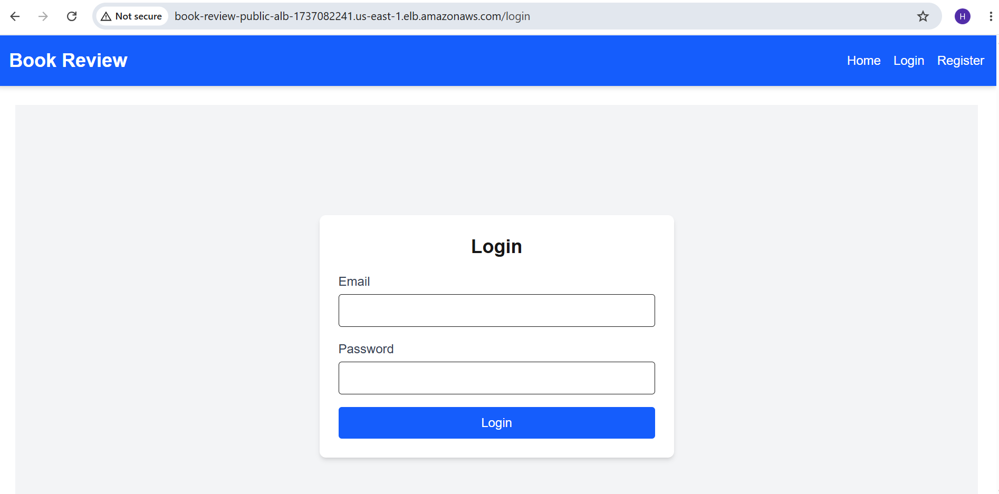
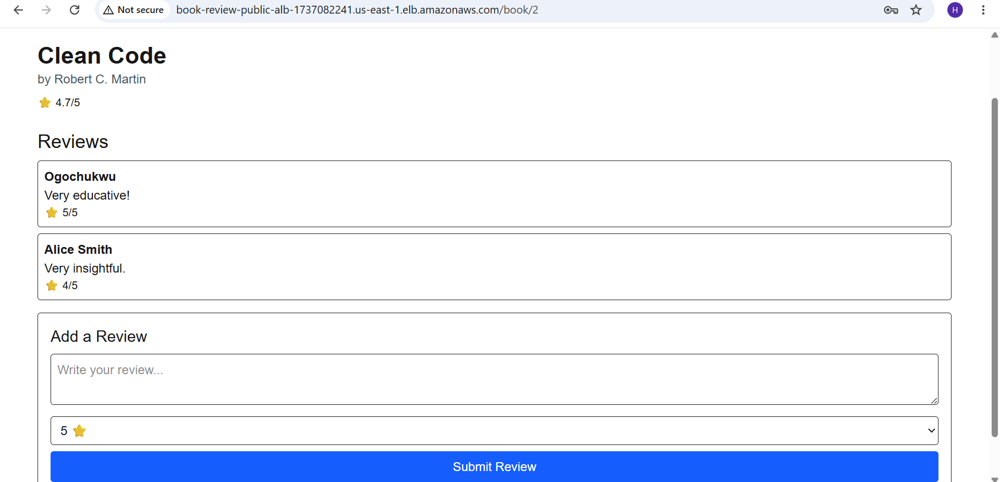
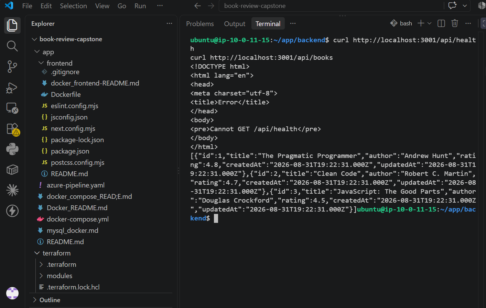
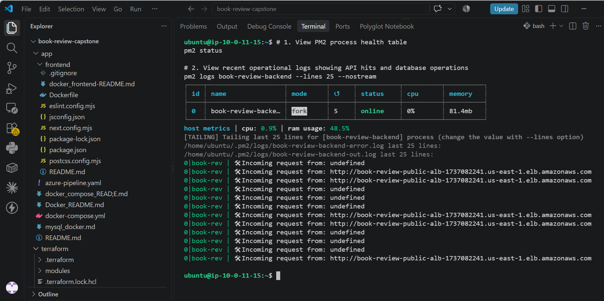
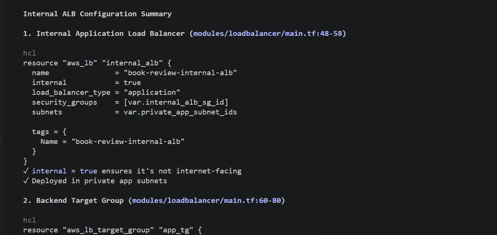
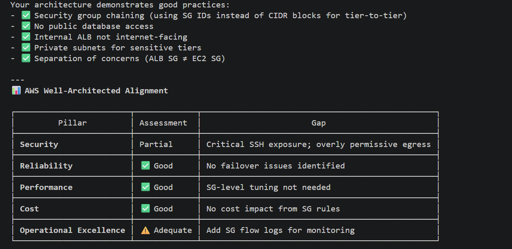
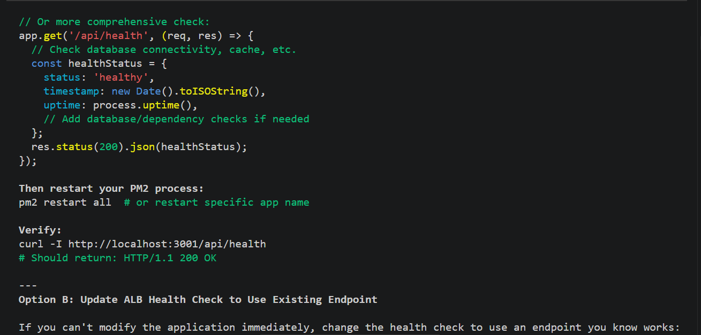

# Capstone Assignment — Deploy the Book Review App Using Terraform and Claude Code Agentic AI

Part of the DevOps Micro Internship (DMI) Cohort 3 with Agentic AI

---

## Student Details

**Full Name:** Onyinyechi Nwoke  
**Cloud Platform:** AWS
**GitHub Repository URL:** https://github.com/Onyinwoke 
**Public Application URL / Load-Balancer DNS:** http://book-review-public-alb-1877082255.us-east-1.elb.amazonaws.com

---

## Purpose

Deploy the Book Review App using Terraform on AWS or Azure in a secure, highly available, production-style three-tier architecture. Use Claude Code, specialized subagents, Terraform MCP, and validation hooks to support the engineering workflow while keeping all infrastructure-changing operations under human control.

---

# Task 0 — Prepare the Project and Agentic AI Environment

## Goal

Prepare the Book Review App project and configure the provided Claude Code Agentic AI starter kit with project context, specialized subagents, Terraform MCP, validation hooks, and safety guardrails.

## Evidence

### Screenshot 1 — Project `CLAUDE.md`

Add a screenshot of the project `CLAUDE.md` showing the three-tier architecture, security boundaries, Terraform requirements, and human-approval rules.

---

### Screenshot 2 — Terraform Engineer Subagent

Add a screenshot showing the Terraform Engineer subagent configuration.

---

### Screenshot 3 — Architecture and Security Reviewer Subagent

Add a screenshot showing the Architecture and Security Reviewer subagent configuration.

---

### Screenshot 4 — Terraform MCP Connection

Add a screenshot showing Terraform MCP connected and available.

---

### Screenshot 5 — Validation Hooks

Add a screenshot showing the configured Claude Code validation hooks.

---

# Task 1 — Design the Three-Tier Architecture

## Goal

Design the required secure, highly available three-tier architecture and create an architecture diagram before building the infrastructure.

The diagram must show:

- VPC or VNet
- Availability Zones or equivalent availability locations
- Six subnets
- Internet connectivity
- NAT or outbound design
- Public load balancer
- Web Tier
- Internal load balancer
- Application Tier
- Managed MySQL
- Read replica
- Main traffic flow

## Architecture Diagram

---

# Task 2 — Build the Terraform Networking and Security Layers

## Goal

Create the modular Terraform project and implement the network and security layers across the required public and private subnets.

## Evidence

### Screenshot 6 — Modular Terraform Project Structure

Add a screenshot showing the modular Terraform project structure.

---

### Screenshot 7 — Six-Subnet Architecture

Add a screenshot showing the six-subnet architecture across two availability locations.

---

### Screenshot 8 — Public and Private Tier Separation

Add a screenshot showing the public and private tier separation, including routing and security boundaries.

---

# Task 3 — Build the Load-Balancing and Compute Layers

## Goal

Deploy the public and internal load balancers and the Web and Application compute resources required by the Book Review App.

## Evidence

### Screenshot 9 — Web and Application Compute

Add a screenshot showing the Web and Application compute resources in their required subnets.

---

### Screenshot 10 — Public Load Balancer

Add a screenshot showing the internet-facing public load balancer.

---

### Screenshot 11 — Internal Load Balancer

Add a screenshot showing the private internal load balancer.

---

### Screenshot 12 — Healthy Targets

Add a screenshot showing healthy target groups or backend pools.

---

# Task 4 — Build the Managed MySQL Database Layer

## Goal

Deploy a private, highly available managed MySQL database with a read replica and restrict database connectivity to the Application Tier.

## Evidence

### Screenshot 13 — Managed MySQL Database

Add a screenshot showing the managed MySQL database deployment.

---

### Screenshot 14 — High Availability

Add a screenshot showing the Multi-AZ or high-availability configuration.

---

### Screenshot 15 — Read Replica

Add a screenshot showing the read replica configuration.

---

### Screenshot 16 — Private Database Access

Add a screenshot showing that the database is private and accepts MySQL traffic only from the Application Tier.

---

# Task 5 — Validate, Review, and Apply the Terraform Configuration

## Goal

Validate the Terraform configuration, review the execution plan using both Agentic AI and human judgment, and apply the infrastructure changes only after all required checks pass.

## Evidence

### Screenshot 17 — Terraform Validation

Add a screenshot showing successful `terraform validate` output.

---

### Screenshot 18 — Terraform Plan

Add a screenshot showing the Terraform plan output.

---

### Screenshot 19 — Terraform Apply

Add a screenshot showing successful `terraform apply` completion.

---

# Task 6 — Deploy and Configure the Book Review Application

## Goal

Deploy and configure the Book Review App across the Web, Application, and Database tiers and verify the complete application functionality.

## Evidence

### Screenshot 20 — Homepage

Add a screenshot showing the Book Review App homepage through the public endpoint.

---

### Screenshot 21 — Login or Authentication

Add a screenshot showing successful login or authentication.

---

### Screenshot 22 — Book Data

Add a screenshot showing the book listing or book details.

---

### Screenshot 23 — Review Functionality

Add a screenshot showing the review functionality working successfully.

---

### Screenshot 24 — Backend or API Evidence

Add a screenshot showing that the backend or API is working successfully.

---

### Screenshot 25 — Database Reads and Writes

Add a screenshot showing successful database reads and writes.

## Public Application URL

**Public Application URL / DNS:** http://book-review-public-alb-1877082255.us-east-1.elb.amazonaws.com

---

# Task 7 — Demonstrate the Agentic AI Workflow

## Goal

Demonstrate how Claude Code assisted with Terraform generation, architecture and security review, and evidence-based troubleshooting while infrastructure-changing decisions remained under human control.

You do not need to submit your complete Claude Code conversation history. Include only focused evidence.

## Evidence

### Screenshot 26 — AI-Assisted Terraform Generation

Add a screenshot showing one useful example of AI-assisted Terraform generation or improvement.

---

### Screenshot 27 — Architecture or Security Review

Add a screenshot showing one structured architecture or security review result.

---

### Screenshot 28 — AI-Assisted Troubleshooting

Add a screenshot showing one AI-assisted troubleshooting interaction based on collected evidence.

---

# Task 8 — Complete the Final Architecture Review

## Goal

Review the completed infrastructure against the original capstone requirements and resolve significant architecture, security, reliability, and cost issues.

Confirm that the final review covers:

- Tier separation
- Availability
- Public exposure
- Routing
- Security rules
- Load balancing
- Database privacy
- Secrets
- Terraform quality
- Module structure
- Reliability
- Obvious cost risks

Use Screenshot 27 as the focused evidence for the structured architecture or security review.

---

# Task 9 — Answer the Reflection Questions

## Goal

Reflect on the architecture, Terraform implementation, and Agentic AI workflow. Answer each question briefly in your own words.

## Architecture

### 1. Why did you separate the Web, Application, and Database tiers?

I separated the three tiers to give each part of the application a specific responsibility. The Web Tier handles user requests, the Application Tier handles the application logic, and the Database Tier stores the data. This also improves security, scalability, and maintenance.

### 2. Why is the Application Tier private?

The Application Tier is private so users on the internet cannot access it directly. Only the Web Tier should communicate with it. This reduces the attack surface and adds another layer of security.

### 3. Why is MySQL private?

MySQL is private because the database should not be directly accessible from the internet. Only the Application Tier needs to communicate with it, which helps protect sensitive application and customer data

### 4. Why are multiple Availability Zones used?

I used multiple Availability Zones to improve availability. If one Availability Zone has a problem, resources in another zone can continue serving the application.

### 5. What is the difference between Multi-AZ/high availability and a read replica?

Multi-AZ is mainly about availability and failover, while a read replica is mainly used to handle read traffic and improve database performance. A read replica provides another copy of the database that can serve read requests.

## Terraform

### 6. How did you divide your Terraform into modules?

I divided the Terraform configuration into separate modules for networking, security, load balancing, and database resources. This made the infrastructure easier to understand, manage, and reuse instead of putting everything into one large main.tf file.

### 7. How do the modules communicate through variables and outputs?

Variables allow the main Terraform configuration to pass information into a module. Outputs allow a module to return information that another module needs. For example, a network module can output subnet IDs that are then used by the load balancer or database module.

### 8. What did you specifically check in `terraform plan`?

I checked what Terraform planned to create, modify, or destroy before applying the changes. I also checked that the resources were being created in the correct subnets and that the planned infrastructure matched the architecture I designed.

## Agentic AI

### 9. What was the purpose of `CLAUDE.md`?

CLAUDE.md provided Claude Code with the project's instructions, architecture requirements, coding conventions, and important constraints. It gave the AI context about how I wanted the project built instead of making it work without understanding the project requirements.

### 10. What work did the Terraform Engineer subagent perform?

The Terraform Engineer subagent helped with the Terraform implementation. It worked on the infrastructure configuration and modules based on the architecture and requirements, helping translate the design into Terraform code.

### 11. What did the Architecture and Security Reviewer identify?

The reviewers checked whether the architecture followed the required security and three-tier design. They helped identify areas such as network exposure, private resources, security group rules, and whether the infrastructure matched the intended architecture.

### 12. Why did you use Terraform MCP instead of relying only on Claude's existing Terraform knowledge?

I used Terraform MCP to give Claude access to more reliable, current Terraform and provider information. Instead of relying only on what the AI already knew, it could use the available Terraform documentation and information when working on the infrastructure.

### 13. What was the purpose of your validation hooks?

The validation hooks were used as safety checks before changes could move forward. They helped catch problems in the Terraform configuration and enforce project rules before infrastructure changes were applied

### 14. Describe one real issue Claude helped you troubleshoot.

One issue was the difficulty connecting to the internal Application Load Balancer from the application server. Claude helped me investigate the problem by checking the network path, security group rules, listener configuration, and target group connectivity instead of simply changing settings randomly

### 15. Describe one recommendation you reviewed, modified, or rejected instead of accepting blindly.

I reviewed Claude's infrastructure recommendations against the architecture requirements before implementing them. Where a recommendation did not fit the required security or network design, I modified it rather than accepting the AI's suggestion automatically. This helped me understand that Agentic AI is an assistant, not a replacement for my own technical judgment.

---

# Task 10 — Publish the Mandatory LinkedIn Post

## Goal

Publish a LinkedIn post describing the capstone, the technical work completed, the Agentic AI workflow, and the lessons learned.

Write the post in your own words, include at least one project image or other proof, and ensure that it can be viewed by the submission reviewer.

## LinkedIn Post URL

**LinkedIn Post URL:** https://www.linkedin.com/posts/nwoke-onyinye_dmibypravinmishra-agenticai-azuredevops-ugcPost-7506115245564862464-mEwb/?utm_source=share&utm_medium=member_desktop&rcm=ACoAAAo3AmwBML7hksPwy4zQreoUkgXVNBf9D1c

---

# Submission Instructions

- Complete Tasks 0–10 in sequence.
- Include all Screenshots 1–28 exactly as specified.
- Ensure that your full name is visible in the required screenshots.
- Include the selected cloud platform.
- Include the completed architecture diagram.
- Include the modular Terraform project structure.
- Include the working public application URL or public load-balancer DNS.
- Include all required Agentic AI workflow evidence.
- Answer all 15 reflection questions briefly in your own words.
- Include the published LinkedIn post URL.
- Do not expose cloud credentials, database passwords, SSH private keys, JWT secrets, access tokens, account IDs, Terraform state containing sensitive values, or other confidential information.
- Review all screenshots and project files carefully before submitting through GitHub.

---

# Completion Checklist

- [ ] Selected AWS or Azure
- [ ] Added and reviewed the Agentic AI starter files
- [ ] Configured `CLAUDE.md`
- [ ] Configured the Terraform Engineer subagent
- [ ] Configured the Architecture and Security Reviewer subagent
- [ ] Connected Terraform MCP
- [ ] Configured validation hooks and safety guardrails
- [ ] Created the architecture diagram
- [ ] Created the six-subnet design
- [ ] Configured public Web Tier routing
- [ ] Kept the Application Tier private
- [ ] Kept the Database Tier private
- [ ] Configured tier-specific Security Groups or NSGs
- [ ] Restricted backend port `3001`
- [ ] Restricted MySQL port `3306` to the Application Tier
- [ ] Created the public load balancer
- [ ] Created the internal load balancer
- [ ] Configured listeners and health checks
- [ ] Deployed the Web Tier compute resources
- [ ] Deployed the private Application Tier compute resources
- [ ] Provisioned private managed MySQL
- [ ] Configured Multi-AZ or high availability
- [ ] Configured a read replica
- [ ] Created the modular Terraform project
- [ ] Used variables, outputs, and module dependencies
- [ ] Used current Terraform documentation through MCP
- [ ] Used hooks for deterministic validation
- [ ] Completed `terraform fmt`
- [ ] Completed `terraform validate`
- [ ] Reviewed `terraform plan`
- [ ] Completed the Terraform Engineer review
- [ ] Completed the Architecture and Security review
- [ ] Applied the infrastructure only after human approval
- [ ] Deployed and configured the backend
- [ ] Deployed and configured the frontend
- [ ] Configured Nginx where required
- [ ] Configured the internal backend endpoint
- [ ] Configured the public frontend endpoint
- [ ] Verified the homepage
- [ ] Verified login or authentication
- [ ] Verified book data
- [ ] Verified review functionality
- [ ] Verified the backend API
- [ ] Verified database reads and writes
- [ ] Verified healthy load-balancer targets
- [ ] Included AI-assisted Terraform generation evidence
- [ ] Included one architecture or security review
- [ ] Included one AI-assisted troubleshooting example
- [ ] Completed the final architecture review
- [ ] Answered all 15 reflection questions
- [ ] Published the mandatory LinkedIn post
- [ ] Added the LinkedIn post URL
- [ ] Captured all 28 required screenshots
- [ ] Confirmed that my full name is visible in the required screenshots
- [ ] Checked that no secrets or sensitive information are exposed

---

## About DMI & CloudAdvisory

DevOps Micro Internship (DMI) is a project-based DevOps program run by Pravin Mishra (The CloudAdvisory), focused on real-world execution, systems thinking, and career readiness.

It helps learners build strong DevOps foundations through hands-on experience.

---

## Resources

- Book Review App Repository: [https://github.com/pravinmishraaws/book-review-app](https://github.com/pravinmishraaws/book-review-app)
- DMI Official Website: [https://dmi.pravinmishra.com](https://dmi.pravinmishra.com)
- University: [https://university.pravinmishra.com](https://university.pravinmishra.com)
- Discord Community: [https://discord.pravinmishra.com](https://discord.pravinmishra.com)
- Blog: [https://dmi.pravinmishra.com/blog](https://dmi.pravinmishra.com/blog)
- YouTube Playlist: [https://www.youtube.com/playlist?list=PLFeSNDtI4Cho](https://www.youtube.com/playlist?list=PLFeSNDtI4Cho)
- Pravin Mishra on LinkedIn: [https://www.linkedin.com/in/pravin-mishra-aws-trainer/](https://www.linkedin.com/in/pravin-mishra-aws-trainer/)
- CloudAdvisory on LinkedIn: [https://www.linkedin.com/company/thecloudadvisory/](https://www.linkedin.com/company/thecloudadvisory/)

---

*This submission is part of the DevOps Micro Internship (DMI) Cohort 3 — Agentic AI Track.*
